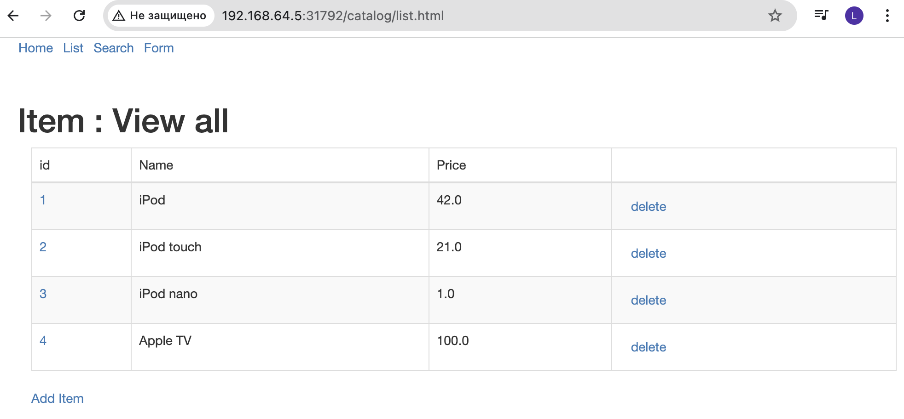
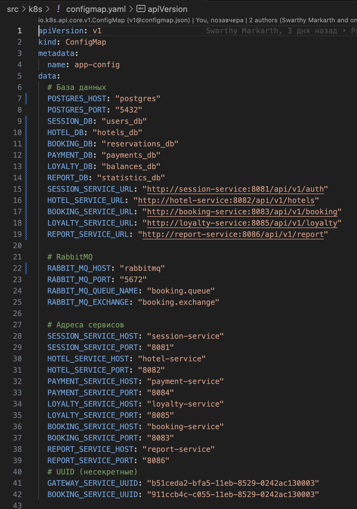
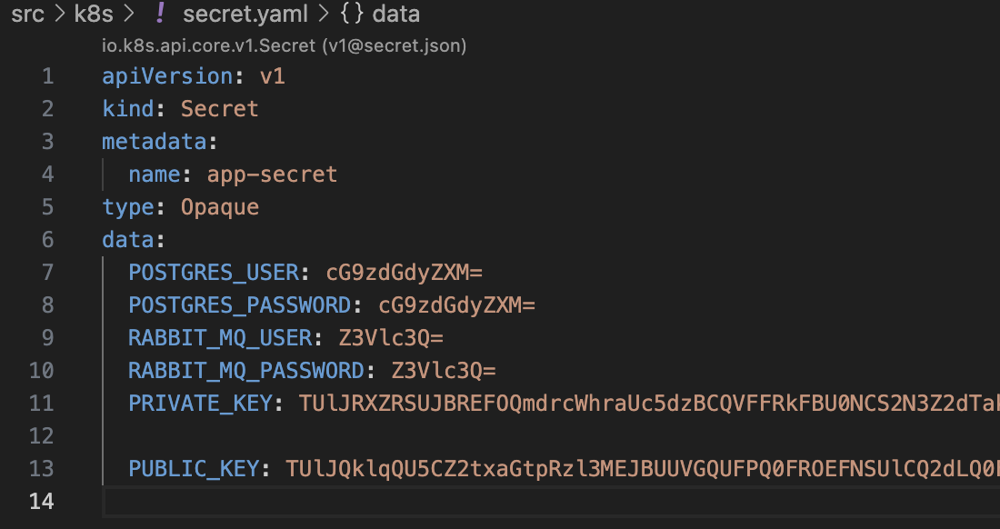
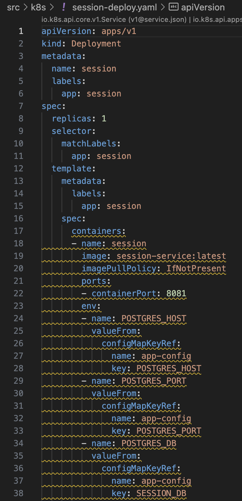
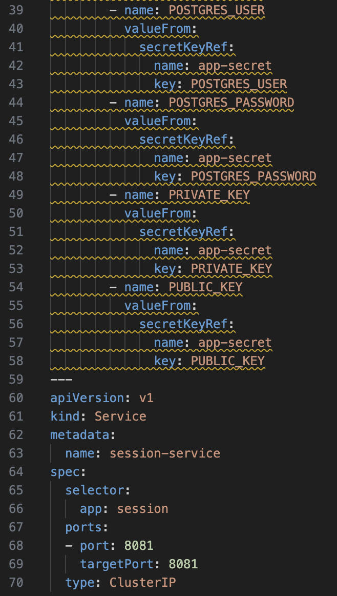
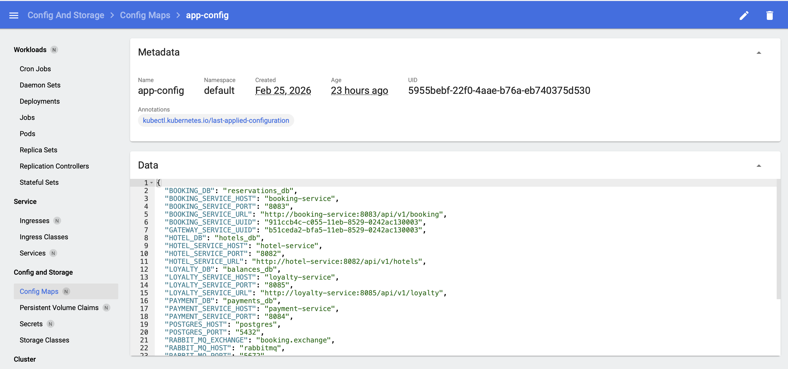

# Basic Kubernetes

## Contents

1. [Chapter I](#chapter-i) 
2. [Chapter II](#chapter-ii) \
   2.1. [Использование готового манифеста](#part-1-использование-готового-манифеста) \
   2.2. [Написание собственного манифеста](#part-2-написание-собственного-манифеста)

## Chapter I

Помимо Docker Swarm существует множество других средств оркестрации. Одним из самых популярных решений является инструмент Kubernetes, разработанный Google. Основное отличие Kubernetes заключается в более высокой сложности и масштабе решения. Kubernetes больше подходит для более серьезных приложений, с большим количеством сервисов и сложным взаимодействием. Помимо этого, Kubernetes обладает рядом дополнительных встроенных инструментов, например, внутренней системой мониторинга.

## Part 1. Использование готового манифеста

### Задание

1. Запустить окружение `Kubernetes` с памятью `4 GB.`

### Основные драйверы для macOS

Драйверы виртуализации Minikube и почему мы выбрали vfkit
Minikube поддерживает несколько драйверов для создания виртуальной машины, в которой работает кластер Kubernetes. Выбор драйвера зависит от операционной системы, наличия прав администратора и установленного ПО. Рассмотрим основные драйверы.

`virtualbox`

Использует `Oracle VirtualBox`.

Требует установки `VirtualBox` и прав администратора для настройки сетевых адаптеров.

Недостатки: на macOS версии 13+ (Ventura и новее) VirtualBox работает нестабильно, часто возникают ошибки с host-only сетью; официально Minikube не рекомендует его использовать на новых версиях macOS.

`hyperkit`

Легковесный гипервизор, разработанный `Docker`.

Требует прав sudo для настройки (установка прав на бинарный файл).

Недостатки: объявлен устаревшим (deprecated) и будет удалён в будущих версиях Minikube; требует прав администратора.

`docker`

Использует `Docker Desktop` для запуска кластера в контейнерах (через `Docker Engine`).

Требует установленного и запущенного `Docker Desktop`, а также прав администратора для его установки и настройки.

Недостатки: занимает много места (образы, виртуальная машина Docker), требует прав администратора, может конфликтовать с другими драйверами.

`vfkit`

Современный драйвер, использующий нативный фреймворк виртуализации Apple (Virtualization.framework).

Не требует прав администратора — работает в пользовательском пространстве.

Преимущества: высокая производительность, низкие накладные расходы, не требует установки дополнительного ПО, официально рекомендуется Minikube для macOS.

Недостатки: требует macOS 11+ (Big Sur) и процессор с поддержкой аппаратной виртуализации (есть на всех современных Mac).

`qemu`

Универсальный эмулятор, поддерживающий аппаратную виртуализацию через Hypervisor.framework.

Может работать без прав администратора, но требует установки QEMU.

Преимущества: гибкость, поддерживает множество архитектур.

Недостатки: сложнее в настройке, может быть медленнее нативных решений.

`parallels`

Использует коммерческий Parallels Desktop.

Требует лицензии и прав администратора.

Недостатки: платный, не в каждой среде доступен.

`vmware`

Использует VMware Fusion (коммерческий).

Требует лицензии и прав администратора.

Недостатки: платный, не всегда доступен.


- Для локального развёртывания `Kubernetes` использован `Minikube`. Выбран драйвер виртуализации `vfkit` – современное решение для macOS, не требующее прав администратора и обеспечивающее высокую производительность.

```
minikube start --memory=4096 --driver=vfkit
```


2. Применить манифест из директории `/src/example` к созданному окружению Kubernetes.
 
 
  Манифест `microservices.yml` содержит описание нескольких объектов `Kubernetes` для развёртывания четырёх тестовых приложений: `apache, catalog, customer, order`. 
 
 Документ состоит из восьми YAML-документов, разделённых` ---`. Каждый документ описывает либо `Deployment` (развёртывание), либо `Service` (сервис).
  Рассмотрим их подробно.
 
**`Deployment` (развёртывание) — 4 штуки**

Пример для ``apache``:

```
yaml
apiVersion: apps/v1
kind: Deployment
metadata:
  creationTimestamp: null
  labels:
    run: apache
  name: apache
spec:
  replicas: 1
  selector:
    matchLabels:
      run: apache
  strategy: {}
  template:
    metadata:
      creationTimestamp: null
      labels:
        run: apache
    spec:
      containers:
      - image: minivozhd/example-apache:latest
        name: apache
        ports:
        - containerPort: 80
        resources: {}
status: {}
```
Описание: 
- **apiVersion: apps/v1** — стабильная версия API для Deployment.

- **kind: Deployment** — объект, управляющий реплицированными подами.

- **metadata:**

**name:** имя развёртывания — **apache**.

**labels**: метка **run: apache**, которая будет присвоена самому Deployment (не подам).

**creationTimestamp: null** — обычно это поле заполняется Kubernetes при создании, здесь указано null для совместимости.

- **spec:**

**replicas: 1** — количество реплик (подов) — одна.

**selector.matchLabels**: селектор, который определяет, какие поды принадлежат этому Deployment. Здесь выбираются поды с меткой **run: apache**.

**strategy: {}** — стратегия обновления не указана, значит будет использоваться стратегия по умолчанию **RollingUpdate** (последовательное обновление).

**template** — шаблон пода, который будет создан:

**metadata.labels:** метки, которые будут присвоены поду. Здесь **run: apache** — это та же метка, что и в селекторе.

**spec.containers:**

**image: minivozhd/example-apache:latest** — Docker-образ, который будет использоваться для контейнера. Образ взят из публичного репозитория Docker Hub пользователя minivozhd.

**name: apache** — имя контейнера внутри пода.

**ports** — список портов, которые открывает контейнер. Здесь **containerPort: 80** — контейнер слушает порт 80 (стандартный порт HTTP).

**resources: {}** — ограничения ресурсов не заданы, контейнер может использовать все доступные ресурсы узла.

**status:** поле для записи состояния объекта, в манифесте оставлено пустым.

Аналогично описаны `Deployment` для `catalog, customer и order`.

**`Service` (сервис) — 4 штуки**

Пример для `apache`:

```
yaml
apiVersion: v1
kind: Service
metadata:
  creationTimestamp: null
  labels:
    run: apache
  name: apache
spec:
  ports:
  - port: 80
    protocol: TCP
    targetPort: 80
  selector:
    run: apache
  type: LoadBalancer
status:
  loadBalancer: {}
```

Опиcание:

- **apiVersion: v1** — базовая версия API для Service.

- **kind: Service** — объект, обеспечивающий постоянный доступ к подам.

- **metadata**:

**name: apache** — имя сервиса.

**labels**: метка **run: apache** для самого сервиса.

**creationTimestamp: null** — аналогично.

- **spec**:

**ports:**

**port: 80** — порт, на котором сервис будет доступен внутри кластера.

**targetPort: 80** — порт контейнера, на который перенаправляется трафик (должен совпадать с containerPort в поде).

**protocol: TCP** — протокол.

**selector: run: apache** — сервис направляет трафик на поды, имеющие метку run: apache.

**type: LoadBalancer** — сервис будет доступен извне кластера через балансировщик нагрузки. В `Minikube` это позволяет использовать команду `minikube service` для открытия приложения в браузере.

**status:** поле для записи статуса, например, выделенного внешнего IP, оставлено пустым.

Аналогично описаны сервисы для `catalog, customer, order`


 Команда для применения:
```
kubectl apply -f src/microservices.yml
```


 Проверка состояния подов
 ```
 kubectl get pods
 ```

3. Запустить стандартную панель управления Kubernetes с помощью команды `minikube dashboard`.

```
minikube dashboard
```
.png)
Эта команда откроет в браузере веб-интерфейс Kubernetes

В дашборде вы сможете увидеть созданные поды, сервисы, деплойменты. 

4. Прокинуть туннели для доступа к развернутым сервисам с помощью команды `minikube service`.

```
minikube service apache
```


Эта команда:

Определит, какой порт и IP назначены сервису apache (тип LoadBalancer в Minikube эмулируется, поэтому внешний IP не назначается, но создаётся туннель).

Автоматически откроет браузер, где откроется страница приложения сервера Apache.

5. Удостовериться в работоспособности развернутого приложения, открыв в браузере страницу приложения (сервис apache).
 
 после выполнения `minikube service apache` на открывшейся веб странице можем выполнять разные действия, например заполнить форму, после чего его сохранить, так же переходим по разным ссылкам

 



## Part 2. Написание собственного манифеста


### Задание

1. Написать собственные yml-файлы манифестов для приложения из первого проекта (`/src/services`), реализующие следующее:
   - карту конфигурации со значениями хостов БД и сервисов,
   Проводим анализ файлов `application.properties` всех семи микросервисов (`booking, session, hotel, gateway, payment, loyalty, report, db`). Выявлены все переменные окружения, необходимые для работы приложений.
   

   `ConfigMap app-config`  служит для хранения несекретных параметров: адреса сервисов, порты, UUID и т.д

   - секреты с паролем и логином к БД и ключами межсервисной авторизации (их можно найти в файлах `application.properties`),


`Secret app-secret` для хранения конфиденциальных данных: логины и пароли `PostgreSQL` и `RabbitMQ`, а также RSA-ключи (private/public) для межсервисной авторизации. Секретные данные потребовали кодирования в base64. Мы выполнили следующие команды в терминале.

Кодирование логина и пароля PostgreSQL:
```
echo -n "postgres" | base64
```
 Кодирование логина и пароля RabbitMQ
```
echo -n "guest" | base64
```
Для RSA-ключей мы сохранили их в отдельные файлы private.key и public.key
```
base64 -b 0 -i private.key -o private.key.b64

```
Применение `ConfigMap и Secret`
После создания файлов мы применили их к кластеру:

```
kubectl apply -f src/k8s/configmap.yaml
kubectl apply -f src/k8s/secret.yaml
```


   - поды и сервисы для всех модулей приложения: postgres, rabbitmq и 7 сервисов приложения. Для всех сервисов нужно использовать единственную реплику.

- Развёртывание PostgreSQL

Приложение требует несколько баз данных (users_db, hotels_db и т.д.), мы создали Docker-образ PostgreSQL, который при старте выполняет скрипт init.sql.  Yаписал Dockerfile:


Затем собрали образ внутри Minikube:
Команда `eval $(minikube docker-env)` настраивает локальный терминал для использования Docker-демона, работающего внутри Minikube. Это позволяет собирать или запускать Docker-образы напрямую в окружении Kubernetes. После команды, обычные команды `docker build` или `docker run` создают образы внутри виртуальной машины minikube.

```
docker build -t custom-postgres:13 .
```
Манифест `postgres-deploy.yaml` включает `Deployment и Service`:


- Развёртывание RabbitMQ
Аналогично создан манифест rabbitmq-deploy.yaml:


- Сборка образов микросервисов

Для каждого микросервиса выполнили сборку образа используя Dockerfile из предъыдущего проекта:
```
docker build -t session-service:latest .
docker build -t hotel-service:latest .
и так далее 
```


- Создание манифестов для микросервисов


Для каждого сервиса был написан отдельный YAML-файл в папке src/k8s. Общая структура включает:

`Deployment` с одной репликой, образом `имя-сервиса:latest`, портом из `application.properties`.

`Service` типа `ClusterIP` с тем же портом.

Переменные окружения, ссылающиеся на `ConfigMap и Secret`.

Пример для session-service (файл session-deploy.yaml):



Аналогично для остальных, с учётом их портов и дополнительных переменных. 

2. Запустить приложение путем последовательного применения манифестов командой `kubectl apply -f <манифест>.yaml`.

- Применение манифестов
```
kubectl apply -f src/k8s/postgres-deploy.yaml
kubectl apply -f src/k8s/rabbitmq-deploy.yaml
kubectl apply -f src/k8s/session-deploy.yaml
kubectl apply -f src/k8s/hotel-deploy.yaml
kubectl apply -f src/k8s/booking-deploy.yaml
kubectl apply -f src/k8s/payment-deploy.yaml
kubectl apply -f src/k8s/loyalty-deploy.yaml
kubectl apply -f src/k8s/report-deploy.yaml
kubectl apply -f src/k8s/gateway-deploy.yaml

```


3. Проверить статус созданных объектов (секреты, конфигурационная карта, поды и сервисы) в кластере с помощью команд `kubectl get <тип_объекта> <имя_объекта>` и `kubectl describe <тип_объекта> <имя_объекта>`. Результат отобразить в отчете.

`kubectl get` - показывает краткую информацию об объектах (список, статус, возраст и т.д.).

`kubectl describe` - показывает подробную информацию о конкретном объекте, включая события, связанные с ним.
- Проверка секретов


- Проверка конфигурационной карты ConfigMap
.png)

- Проверка подов
 ```
 kubectl get pods
 ```
 

 

 - Проверка сервисов
```
kubectl get services
```


Сетевая инфраструктура проекта реализована через сервисы типа ClusterIP, что обеспечивает стабильное взаимодействие между микросервисами по внутренним именам (например, session-service:8081). Каждый сервис успешно обнаружил свои целевые поды (наличие Endpoints), а разделение портов исключает конфликты внутри сети. База данных и брокер сообщений изолированы внутри кластера, доступ к ним извне ограничен в целях безопасности.

4. Проверить наличие правильных значений секретов, применив, например, команду `kubectl get secret my-secret -o jsonpath='{.data.password}' | base64 --decode` для декодирования секрета.

- Чтобы убедиться, что секреты содержат правильные данные, декодируем , например, пароль PostgreSQL:
```
kubectl get secret app-secret -o jsonpath='{.data.POSTGRES_PASSWORD}' | base64 --decode
```


5. Проверить логи приложения, запущенного в кластере, командой `kubectl logs <имя_контейнера>`. Скриншот отобразить в отчете.
Посмотрим логи  одного из работающих подов

```
kubectl logs gateway-79b4ffb7c7-7w57b --tail=30
```


6. Прокинуть туннели для доступа к gateway service и session service.

```
kubectl port-forward service/gateway-service 8087:8087 &
kubectl port-forward service/session-service 8081:8081 &
```
Туннели успешно установлены, что позволило обращаться к сервисам на локальных портах

7. Запустить функциональные тесты Postman и удостовериться в работоспособности приложения.


8. Запустить стандартную панель управления Kubernetes с помощью команды `minikube dashboard`. Отобразить в отчете следующую информацию в виде скриншотов с дашборда: текущее состояние узлов кластера, список запущенных Pod, а также другие метрики, такие как загрузка ЦП и память, логи Pod, конфигурации и секреты.

запустили дашборд командой `minikube dashboard` (после включения metrics-server). Открылся веб-интерфейс, в котором были сделаны следующие скриншоты:
- текущее состояние узлов кластера 


- писок запущенных Pod


- Метрики CPU и памяти

- Логи пода


- ConfigMap 


- Secret 


9. Обновить приложение (добавив новую зависимость в pom-файл) и пересобрать его со следующими стратегиями развертывания (замерить время переразвертывания приложения для каждого случая и отметить результаты в отчете):
   - пересоздание (recreate),
   - последовательное обновление (rolling).
 
 Стратегии развертывания в `Kubernetes: Recreate и RollingUpdate`

При обновлении приложения (например, выхода новой версии) Kubernetes использует стратегию, описанную в манифесте Deployment. От выбранной стратегии зависит, как именно будут заменяться старые поды новыми, и будет ли простой в работе сервиса.

-  `Recreate (пересоздание)`

Сначала **удаляются все старые поды** текущей версии.
После того как все старые поды остановлены, **создаются новые поды** с новой версией.

`Плюсы:`

Простота: гарантирует, что одновременно не будут работать разные версии.

Полезна, если приложение не поддерживает одновременную работу нескольких версий (например, из-за изменений в схеме БД).

`Минусы:`

Возникает простой (downtime) – время между удалением старых и запуском новых подов, когда сервис недоступен.

Время обновления складывается из времени graceful shutdown старых подов + время запуска новых.
-  `RollingUpdate (последовательное обновление)`

Новые поды создаются постепенно, одновременно со старыми.

Параметры maxSurge и maxUnavailable контролируют, на сколько может быть превышено желаемое количество реплик и сколько реплик может быть недоступно во время обновления.

По умолчанию: maxSurge=25%, maxUnavailable=25% 

`Плюсы:`

Нет простоя – в любой момент времени хотя бы одна реплика приложения доступна.

Обновление происходит плавно, можно контролировать скорость.

`Минусы:`

В течение некоторого времени работают одновременно две версии приложения, что может вызвать проблемы, если версии несовместимы.

Требует больше ресурсов (одновременно работают старые и новые поды).

Внесем изменения в код `gateway-service` добавим в код зависимость `spring-boot-starter-actuator` - это именение добавит в приложение эндпоинты для мониторинга `/actuator/health`.

добавим в файл `pom.xml` 
```
   <!-- Spring Boot Actuator for monitoring -->
        <dependency>
            <groupId>org.springframework.boot</groupId>
            <artifactId>spring-boot-starter-actuator</artifactId>
        </dependency>
```
Пересобираем образ с тегом v2
```
docker build -t gateway-service:v2 .
```


Далее создадим 2 копии сервиса 
```
cp gateway-deploy.yaml gateway-deploy-recreate.yaml
cp gateway-deploy.yaml gateway-deploy-rolling.yaml
```
и отредактируем каждый

`Файл gateway-deploy-recreate.yaml`

В секции `spec`добавьте strategy с типом `Recreate`.

И  `image: gateway-service:latest` на `image: gateway-service:v2`.


`Файл gateway-deploy-rolling.yaml`
 
 В Kubernetes по умолчанию применяется стратегия RollingUpdate, но мы укажем ее явно .
 

 - Применение стратегии Recreate и замер времени

 ```
 time (kubectl apply -f gateway-deploy-recreate.yaml && kubectl rollout status deployment/gateway)
 ```
 
 - Применение стратегии RollingUpdate и замер времени
 ```
 time (kubectl apply -f gateway-deploy-rolling.yaml && kubectl rollout status deployment/gateway)
 ```
 

 `Результаты измерений`
- Стратегия `Recreate`: время переразвёртывания (включая ожидание готовности пода) – 1.611 с.

- Стратегия `RollingUpdate`: время переразвёртывания – 0.291 с.


**Вывод:** `RollingUpdate` оказался быстрее и не вызывает простоя, что делает его предпочтительным для production-сред, даже при малых временах перезапуска.